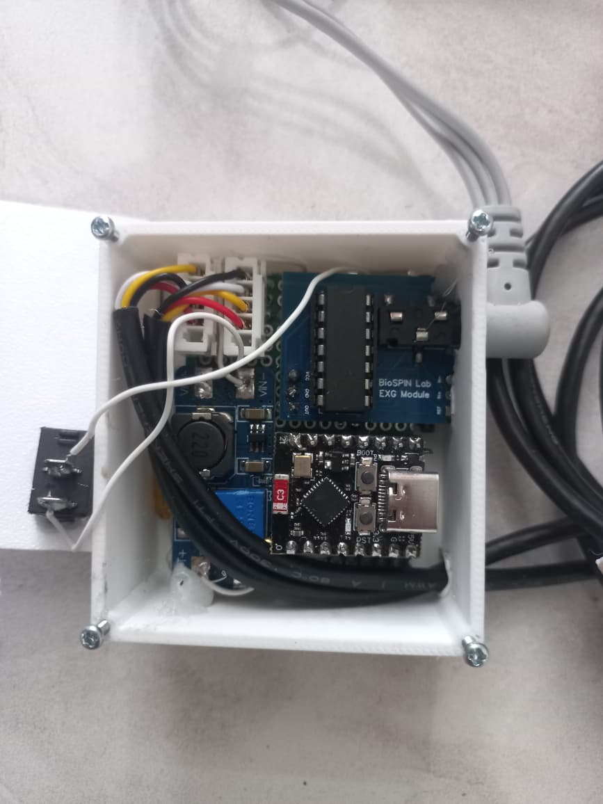
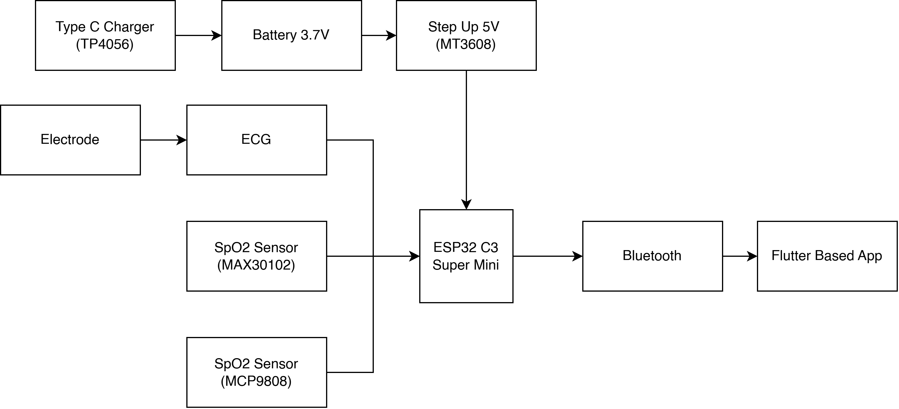
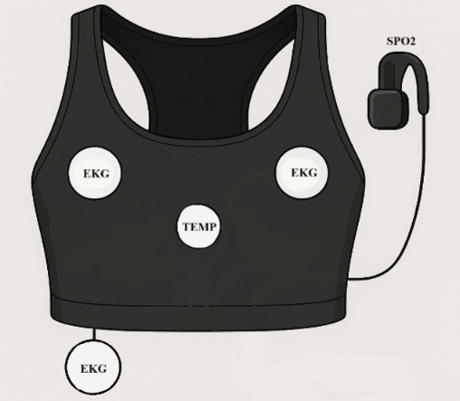
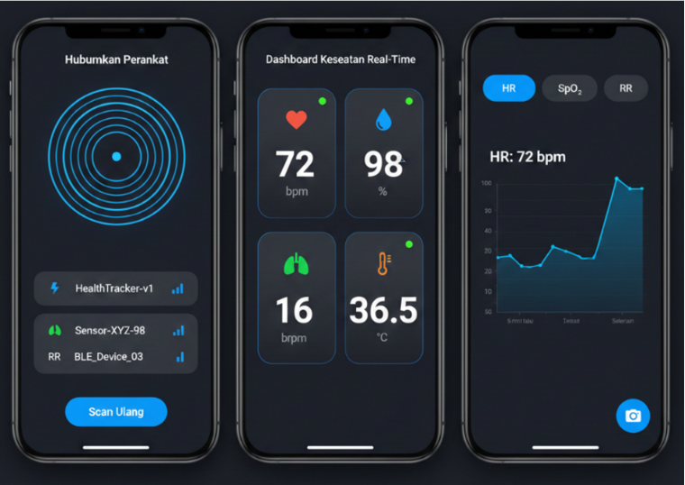
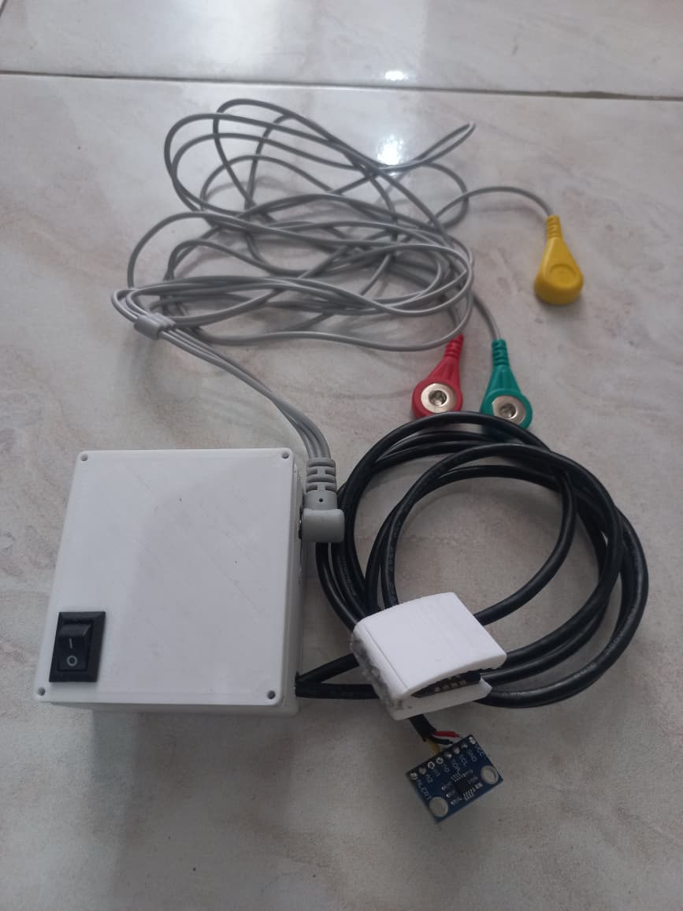

# Athlete Health Monitoring Vest

## Overview

The Athlete Health Monitoring Vest is an IoT-based wearable system designed to monitor athletes' physiological parameters during training and physical activities.

The system utilizes an ESP32-C3 SuperMini microcontroller to acquire Electrocardiography (ECG), blood oxygen saturation (SpO₂), and body temperature data. Sensor data are transmitted wirelessly via Bluetooth Low Energy (BLE) to an Android application for real-time monitoring and visualization.

This project aims to provide a portable and low-power wearable health monitoring solution for athlete performance assessment and physiological monitoring.

---

## Features

- Real-time ECG monitoring
- Real-time SpO₂ monitoring
- Real-time body temperature monitoring
- Bluetooth Low Energy (BLE) communication
- Android application for real-time visualization
- Portable battery-powered operation
- Lightweight wearable vest design

---

## System Architecture

---

## Hardware Components

| Component | Function |
|------------|------------|
| ESP32-C3 SuperMini | Main microcontroller |
| Custom ECG Module | ECG signal acquisition |
| MAX30102 | Blood oxygen saturation monitoring |
| MCP9808 | Body temperature monitoring |
| LiPo Battery 450 mAh | Portable power source |
| TP4056 | Battery charging and protection |
| MT3608 Step-Up Converter | Voltage regulation |

---

## Sensor Configuration

### ECG Monitoring

ECG signals are acquired using a custom-developed ECG acquisition module.

Related Repository:

https://github.com/rizaaria/Biopotential-Signal-Acquisition-EXG

### SpO₂ Monitoring

Blood oxygen saturation is measured using the MAX30102 optical sensor.

### Temperature Monitoring

Body temperature is measured using the MCP9808 high-accuracy digital temperature sensor.

---

## Sensor Placement

Sensors are positioned to maximize signal quality and user comfort during physical activities.

- ECG electrodes placed on the chest area.
- MAX30102 sensor attached to the ear lobe.
- MCP9808 temperature sensor positioned inside the vest.

---

## Mobile Application

A Flutter-based Android application was developed for real-time monitoring and visualization.

---

## Hardware Design

The hardware system was designed to ensure portability, comfort, and stable sensor placement.

---

## Disclaimer

This project was developed for educational, research, and prototype purposes. It is not intended to replace certified medical devices or professional medical diagnosis.
